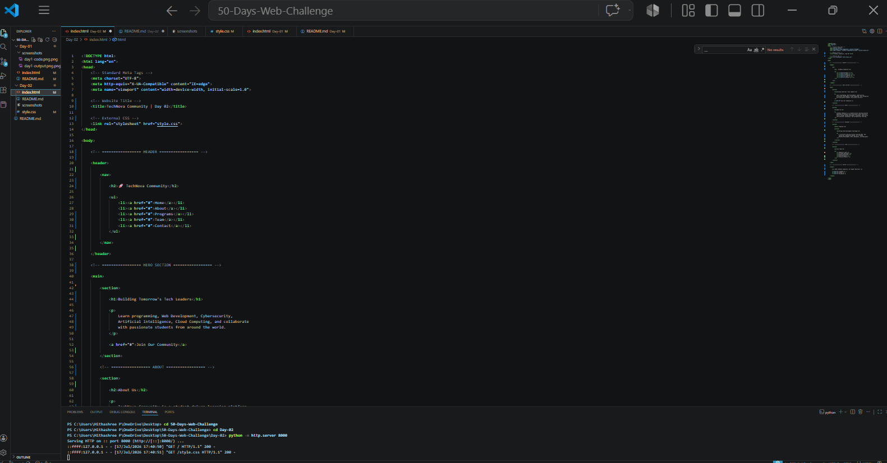
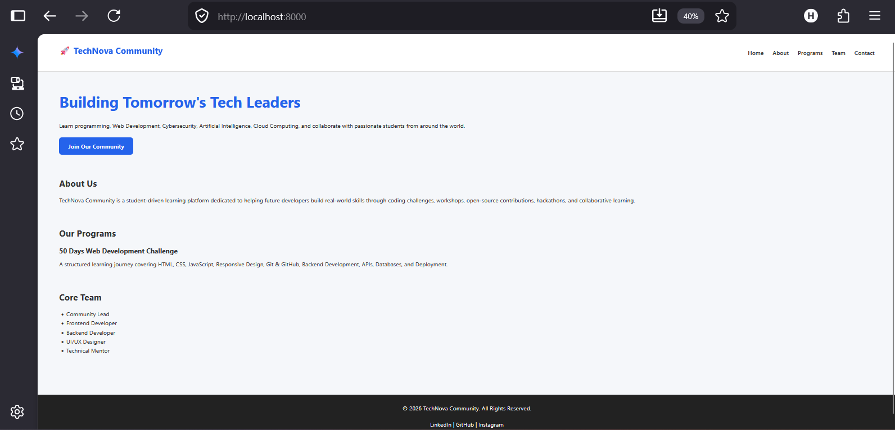

# Day 02 - CSS Box Model & Universal Reset

## 📌 Objective

Learn how to connect CSS with HTML and understand the CSS Box Model by applying a Universal Reset.

---

## 🛠 Technologies Used

- HTML5
- CSS3

---

## 📚 Concepts Learned

- Linking CSS to HTML
- Universal Selector (*)
- Margin
- Padding
- Box Model
- box-sizing: border-box
- CSS Variables (:root)
- Body Styling

---

## 🚀 Outcome

Successfully connected a stylesheet to the HTML page and created a clean, consistent foundation for future styling.

---

## 📸 Screenshots

### VS Code

### Browser Output

