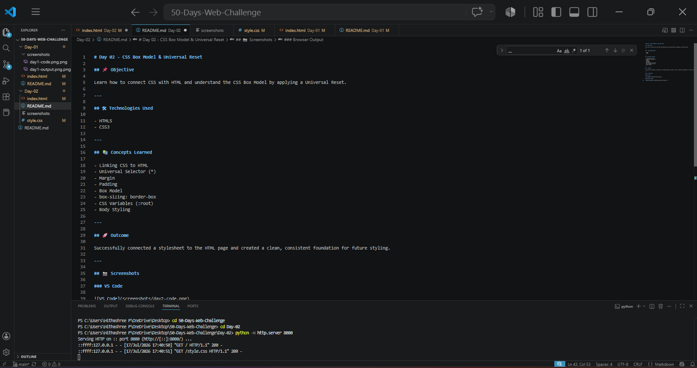
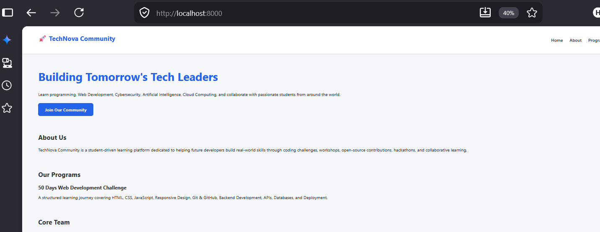

# Day 02: CSS Box Model & Universal Reset

## 📝 What I Built
Today I added CSS styling to my TechNova community page. I learned about the CSS Box Model and applied a Universal Reset to remove browser default styles.

**Live Demo:** https://hithashree-git.github.io/50-Days-Web-Challenge/Day-02/

## 📸 Screenshots

### 💻 Code View

*Figure 1: Screenshot of the CSS code implementation*

### 🌐 Browser Output

*Figure 2: Screenshot of the styled page in browser*

## 🔑 Key Learnings

### 1. CSS Box Model
- **Content:** The actual content (text, images)
- **Padding:** Space between content and border
- **Border:** The edge around the padding
- **Margin:** Space outside the border

### 2. Universal Reset
```css
* {
    margin: 0;
    padding: 0;
    box-sizing: border-box;
}