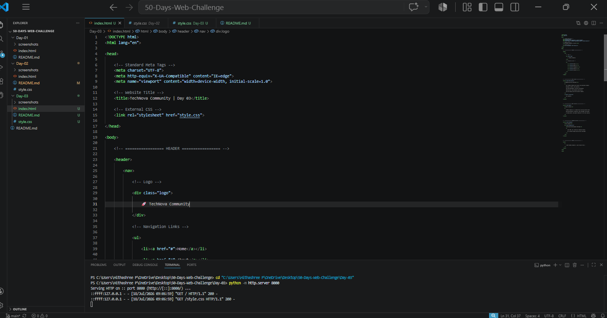
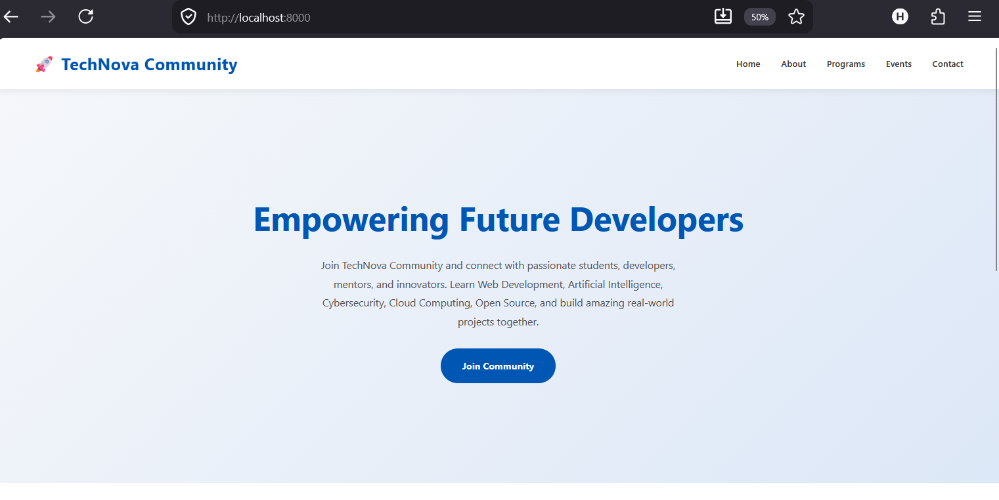

# 🚀 Day 03 – Flexbox Navigation & Hero

## 📌 Overview

On Day 3, I learned how to use **CSS Flexbox** to create a modern navigation bar and a centered Hero section.

This project is part of my **50 Days Web Development Challenge**.

---

## 📚 What I Learned

- CSS Flexbox
- display: flex
- justify-content
- align-items
- flex-direction
- gap
- Hover Effects
- Responsive Design

---

## 💻 Technologies

- HTML5
- CSS3

---

## ✨ Features

- Responsive Navigation Bar
- Centered Hero Section
- Hover Animations
- Gradient Background
- Sticky Navigation
- Responsive Layout

---

## 📸 Screenshots

### Code

### Output

---

## 🎯 Outcome

Built a modern landing page using Flexbox while understanding parent-child layout behavior.