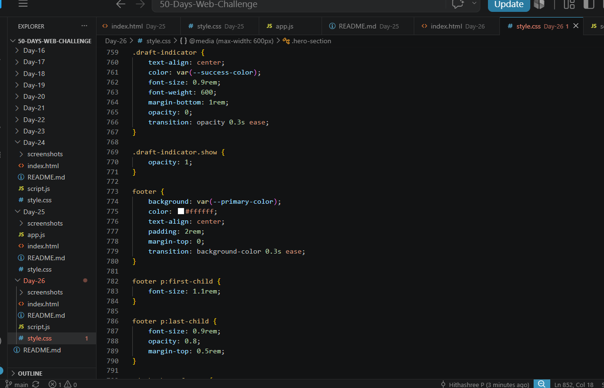
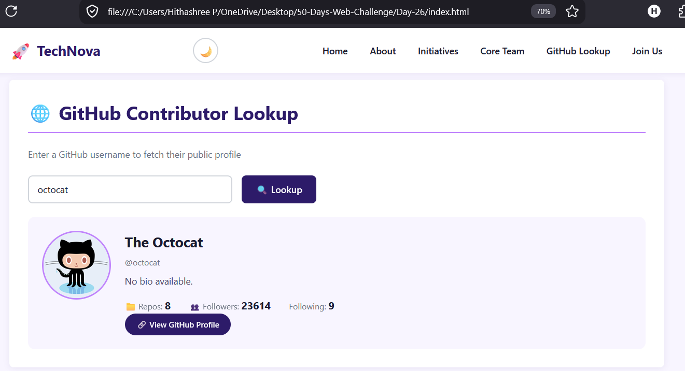

# Day 26: Asynchronous JavaScript & External APIs

## 📝 What I Built
Today I built a GitHub Contributor Lookup tool that fetches real-time profile data from the GitHub API.

## 📸 Screenshots

### 💻 Code View


### 🌐 Browser Output


### ✅ Successful API Call


### ❌ Error Handling


## 🔑 Key Learnings

### 1. Async/Await Syntax
```javascript
async function fetchData(username) {
    try {
        const response = await fetch(`https://api.github.com/users/${username}`);
        const data = await response.json();
        // Use data
    } catch (error) {
        // Handle error
    }
}